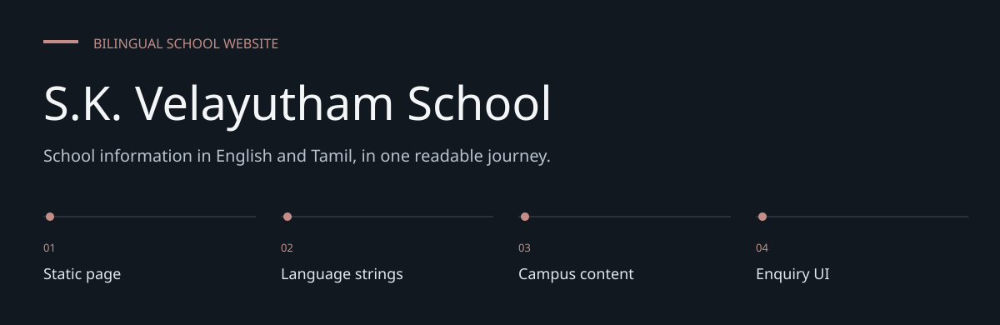
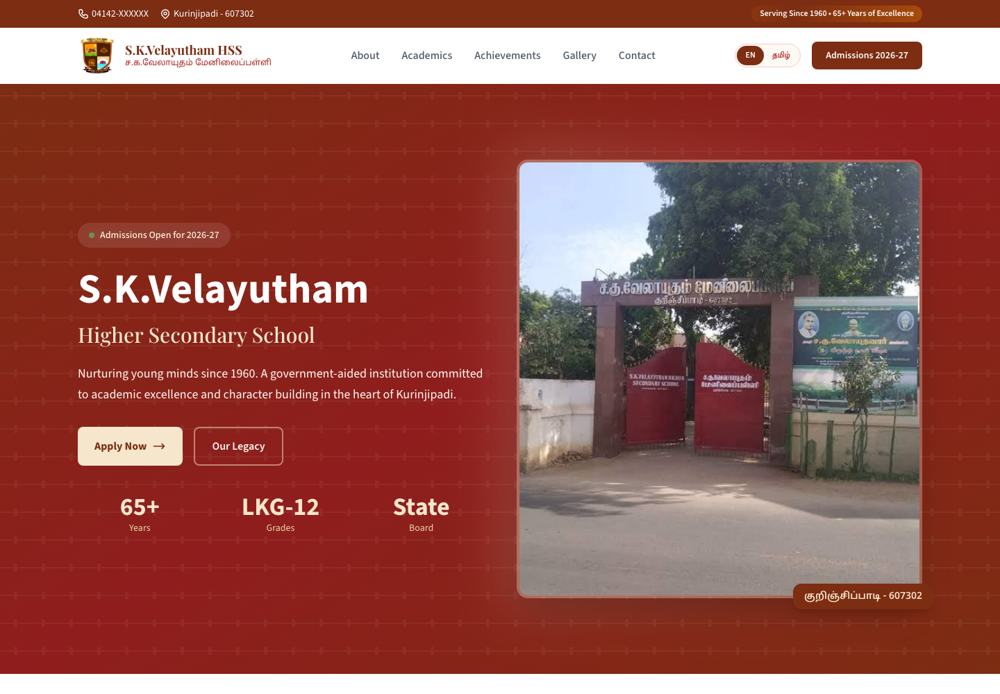
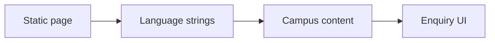

# S.K. Velayutham School

**School information in English and Tamil, in one readable journey.**

A single-page English/Tamil school website for S.K. Velayutham Higher Secondary School,
Kurinjipadi. The repository contains the page, school imagery and design/release notes.


[Architecture](docs/ARCHITECTURE.md) · [Evaluation guide](docs/EVALUATION.md)

**Contents:** [The challenge](#the-challenge) · [Walkthrough](#walk-through-the-project) ·
[Implementation](#implementation-state) · [Design choices](#engineering-choices) ·
[Next evidence](#next-evidence-to-collect)

---

## The challenge

Families need school, education-stage, facilities and admissions information in an accessible
language. This single-page site brings English and Tamil content together and places
enquiry/contact information in the same journey.

## Browser preview



*Captured from the tracked website in Chromium on 7 October 2026. This is a local rendering, not a
claim about current public hosting.*

## System at a glance



## Walk through the project

### 1. Read the introduction

Open the landing section and inspect school identity and the English/Tamil strings attached to
content.

### 2. Explore education and campus

Move through education stages, sports, academics, events and facilities. Verify image meaning and
content accuracy with the school.

### 3. Review admissions

Inspect the admissions date and enquiry controls. These are public content and UI, not evidence
that an admissions backend exists.

### 4. Check both languages

Test language switching, navigation, narrow screens and keyboard use. Missing translations or
focus behavior affect the actual reading path.

## Page structure

The page introduces the school, education stages, sports and academics, campus/events,
facilities, admissions and contact information. English and Tamil strings are embedded
alongside the corresponding UI elements.

## Preview locally

```bash
git clone https://github.com/DanushArun/SKV-school-website.git
cd SKV-school-website
python3 -m http.server 8080
```

Open `http://localhost:8080`. There is no dependency installation or build step.
Remote scripts, fonts and other externally linked resources still need network access.

## Repository map

- [index.html](index.html): markup, styling references and page behavior.
- [images](images): school photographs and logo.
- [REDESIGN.md](REDESIGN.md): design notes.
- [PRODUCTION_READY.md](PRODUCTION_READY.md): recorded release notes.

## Publishing and evidence

Serve the static files through a static host. Review Tamil/English switching, navigation,
mobile layout and enquiry behavior in a browser before releasing an edit.
School history, admissions dates and institutional claims are content supplied by the site;
this documentation review does not independently verify them.

Tracked files and local preview instructions were reviewed. A local Chromium preview was captured;
no live deployment or complete browser acceptance suite was run. The repository has no backend
application or automated
test suite, so an enquiry form UI alone is not proof of delivered admissions enquiries.

## Engineering choices

**Single-page structure.** Related school information stays within one navigation context.

**Paired language strings.** English and Tamil content sit with the corresponding elements.

**Content is separate from service.** A form presentation does not establish a delivered enquiry
workflow.

## Implementation state

| State | Current evidence |
| --- | --- |
| Present | Bilingual page content and school imagery |
| Present | Admissions and contact presentation |
| Not present | Application backend or automated test suite |
| Needs verification | Enquiry delivery, content dates and accessibility |

The [architecture guide](docs/ARCHITECTURE.md) maps these statements to source entry points.
The [evaluation guide](docs/EVALUATION.md) separates inspection, executable checks and
domain validation, with the next evidence needed for each project.

## Next evidence to collect

- Validate admissions copy with the school.
- Test both language paths and enquiry actions.
- Record mobile and accessibility acceptance evidence.

## Recorded checks — 7 October 2026

| Check | Observation |
| --- | --- |
| Browser preview | Loaded without page errors; screenshot captured |

Commands used:

```text
Chromium at 1440 × 1000
```

These results cover the listed software paths. They do not establish live deployment,
external-service compatibility, accessibility conformance or domain efficacy.
