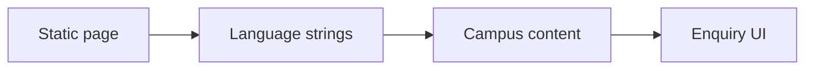

# S.K. Velayutham School — Architecture and implementation

This guide follows the tracked implementation. Proposed work is identified separately.

## The problem and the system boundary

Families need school, education-stage, facilities and admissions information in an accessible
language. This single-page site brings English and Tamil content together and places
enquiry/contact information in the same journey.

## Processing path

## End-to-end behavior

### 1. Read the introduction

Open the landing section and inspect school identity and the English/Tamil strings attached to
content.

### 2. Explore education and campus

Move through education stages, sports, academics, events and facilities. Verify image meaning and
content accuracy with the school.

### 3. Review admissions

Inspect the admissions date and enquiry controls. These are public content and UI, not evidence
that an admissions backend exists.

### 4. Check both languages

Test language switching, navigation, narrow screens and keyboard use. Missing translations or
focus behavior affect the actual reading path.

## Design choices and consequences

### Single-page structure

Related school information stays within one navigation context.

### Paired language strings

English and Tamil content sit with the corresponding elements.

### Content is separate from service

A form presentation does not establish a delivered enquiry workflow.

## Source entry points

### [index.html](../index.html)

This file is part of the reviewed path described above. Follow its imports and calls
for the exact interface rather than inferring behavior from the filename.

### [REDESIGN.md](../REDESIGN.md)

This file is part of the reviewed path described above. Follow its imports and calls
for the exact interface rather than inferring behavior from the filename.

### [PRODUCTION_READY.md](../PRODUCTION_READY.md)

This file is part of the reviewed path described above. Follow its imports and calls
for the exact interface rather than inferring behavior from the filename.

## Implementation state

| State | Evidence boundary |
| --- | --- |
| Present | Bilingual page content and school imagery |
| Present | Admissions and contact presentation |
| Not present | Application backend or automated test suite |
| Needs verification | Enquiry delivery, content dates and accessibility |

“Present” means tracked source or assets exist. It does not mean a production or domain
validation has passed. See [Evaluation](EVALUATION.md) for reproducible checks and limits.
